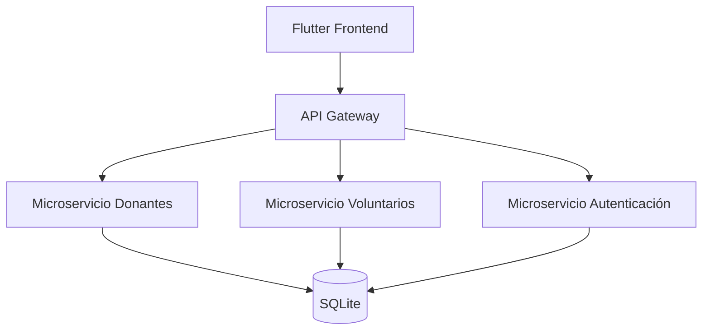

## 1. Componentes Principales
- **Frontend**: Aplicación Flutter (móvil/web).  
- **API Gateway**: Punto único de entrada para las APIs (FastAPI).  
- **Microservicios**:  
  - `donors_ms`: Gestión de donantes.  
  - `volunteers_ms`: Gestión de voluntarios.  
  - `auth_ms`: Autenticación JWT.  
- **Base de Datos**: SQLite (almacena datos de donantes, voluntarios y usuarios).  

## 2. Flujo de Datos
1. El frontend se comunica con el API Gateway.  
2. El API Gateway redirige las peticiones a los microservicios correspondientes.  
3. Cada microservicio lee/escribe en la base de datos.  

## 3. Tecnologías
| Componente       | Tecnología           |
|------------------|----------------------|
| Frontend         | Flutter (Dart)       |
| Backend          | Python (FastAPI)     |
| Base de Datos    | SQLite               |
| Autenticación    | JWT                  |
